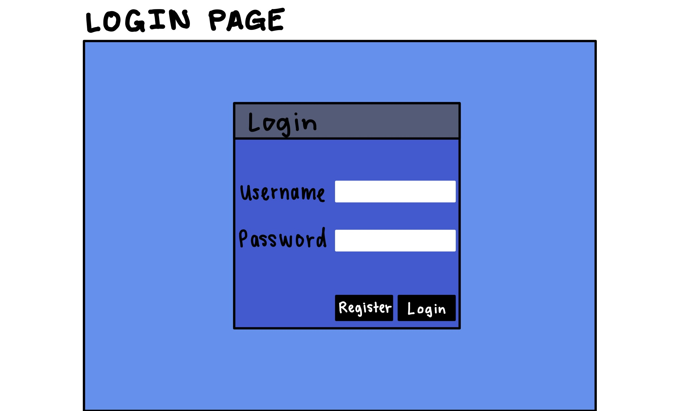
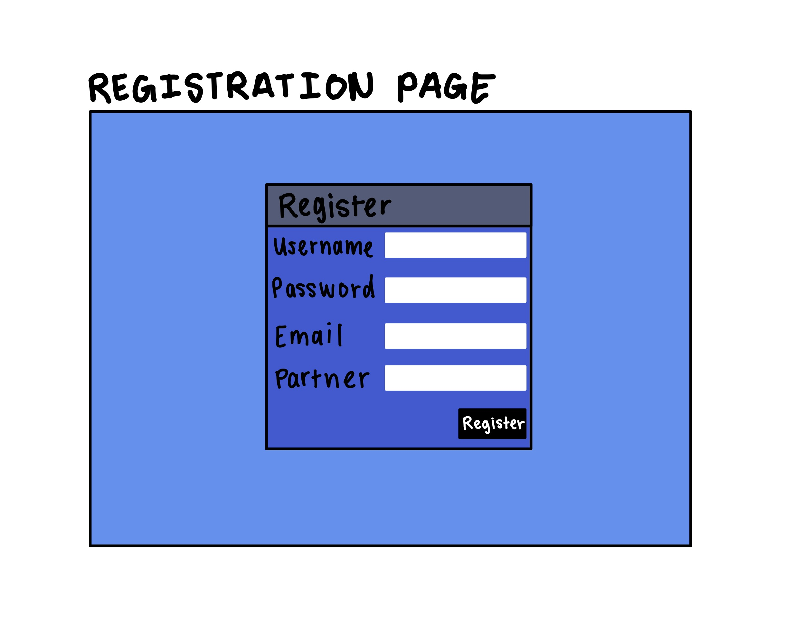
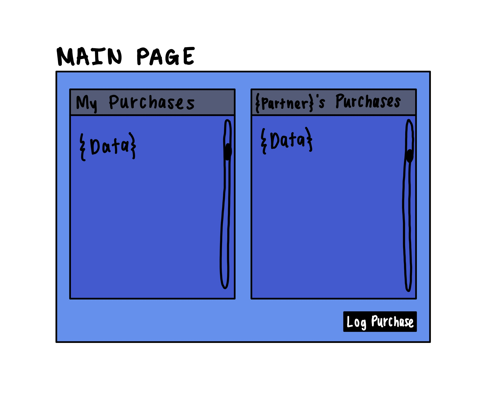
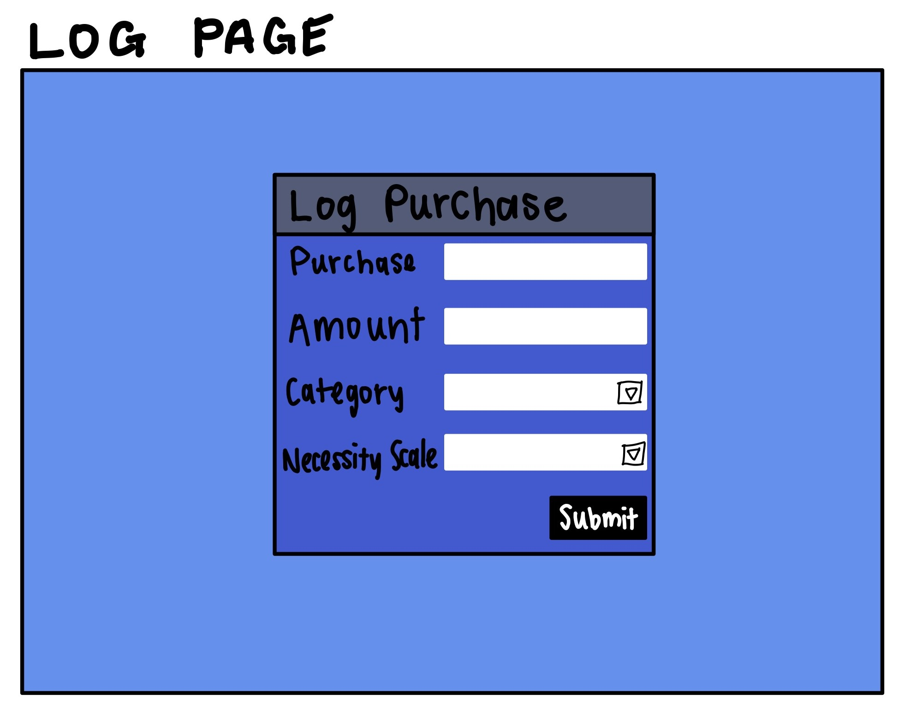
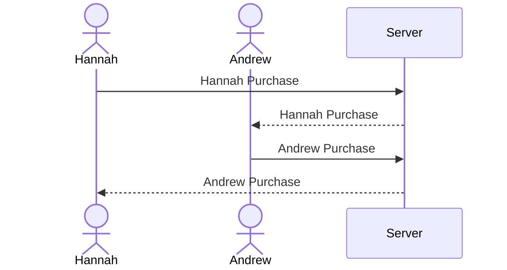

# Startup
CS 260 Startup
## Link to Notes.md
[Notes for CS260](notes.md)

# Startup Deliverable
## Elevator Pitch
Keeping track of your and your partner's spending habits and understanding the purchases you make can be difficult but my application will make this task simple and insightful. The users can connect with each other on my web application to track, categorize, and rate the necessity of their spending habits. The application will display each user's logged purchases and offer deeper insights into how couples can manage their finances together.

## Design

Here is a sequence diagram that shows how a user would interact with the backend to log a new purchase.

## Key Features
- Secure login over HTTPS
- Ability to log a spending activity
- When logging a spending activity, the user can choose a category and rate the necessity of the purchase
- Ability to link to another user and view the information that they have logged
- Logged purchases are persistently stored

## Representing Technologies

I am going to use the required technologies in the following ways. 

- **HTML** 4 HTML pages. One for login, one for registration, one for logging a purchase, and one for viewing you and your partner's spending history. 

- **CSS** Application styling that looks good on diffent screen types. Cohesive and well designed color scheme

- **JavaScript** Allows for navigation across the app and validates the information in the forms. 

- **React** Provides login, updates spending logs, displays spending logs on main page.

- **Service**
    - Backend services with endpoints for login
    - Logging a purchase
    - Retriving your purchases
    - Retriving your partners purchases

- **DB/Login** Users data will be stored and called from a Database. This includes Login information, a reference to the user that they're linked to and the purchase information that the users input into the website. 

- **WebSocket** When one user logs a purchase, the information will be updated and displayed in real time on their partner's screen. 

# HTML Deliverable
- [x] **HTML pages** - Five HTML Pages that allow users to login, connect with other users, log purchases, view their and their partner's logged data, and a basic about page. 
- [x] **Links** - Each page features a menu bar that links to all of the other pages in the application.
- [x] **Images** - Added images to the about.html page that fit the vibe of the application. I don't love these so I'm intending to revamp them.
- [x] **Login Placeholder** - login form is present on the index.html page
- [x] **Database Data Placeholder** - Database data placeholders are mainly found on the display.html page where the current user's financial logs are displayed. There is also a database placeholder on the log.html page where it displays the user that is making the new log. 
- [x] **Websocket** - The connected user's data will be populated on the display.html page via Websocket. 
- [x] **Third Party Service Call** - The about.html page will display a random fact pulled from the Entertainment section of the Public APIs that were provided in the cs260 github. 

# CSS Deliverable
- [x] **Header, footer, and main content body** I created individual css files for each page that styled the main section. The footer and header elements were styled using a theme.css file that applies to all pages.
- [x] **Navigation elements** - I created cohesive headers and footers that are used on every page
- [x] **Responsive window sizing** - I used the ideas we were taught in the flex assignment to make sure the windows were resizing appropriately
- [x] **Application Elements** - I made buttons using bootstrap and styled the other relevant elements to pair cohesively with the bootstrap elements.
- [x] **Application Images** - There are images on the about page that I have resized to make them appear more aesthetically cohesive with the rest of the application. 