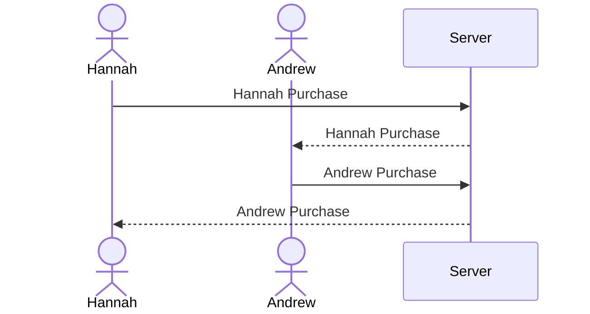

# Startup
CS 260 Startup
## Link to Notes.md
[Notes for CS260](notes.md)

# Startup Deliverable
## Elevator Pitch
Keeping track of your and your partner's spending habits and understanding the purchases you make can be difficult but my application will make this task simple and insightful. The users can connect with each other on my web application to track, categorize, and rate the necessity of their spending habits. The application will display each user's logged purchases and offer deeper insights into how couples can manage their finances together.

## Design

[Mock](design/registrationPage.jpg)
[Mock](design/mainPage.jpg)
[Mock](design/logPage.jpg)

Here is a sequence diagram that shows how a user would interact with the backend to log a new purchase.

## Key Features
-Secure login over HTTPS
-Ability to log a spending activity
-When logging a spending activity, the user can choose a category and rate the necessity of the purchase
-Ability to link to another user and view the information that they have logged
-Logged purchases are persistently stored

## Representing Technologies

I am going to use the required technologies in the following ways. 

-**HTML** 3 HTML pages. One for login/registration, one for logging a purchase, and one for viewing you and your partner's spending history. 

-**CSS** Application styling that looks good on diffent screen types. Cohesive and well designed color scheme

-**JavaScript** 

-**React**

-**Service** Backend services with endpoints for login, logging a purchase, retriving your purchases, Retriving your partners purchases

-**DB/Login** Users data will be stored and called from a Database. This includes Login information, a reference to the user that they're linked to and the purchase information that the users input into the website. 

-**WebSocket** When one user logs a purchase, the information will be updated and displayed in real time on their partner's screen. 